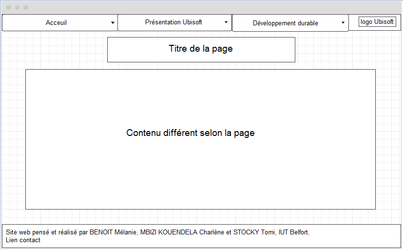

# Ubisoft-SAE_D

Groupe D1
BENOIT Mélanie
STOCKY Tomi
MBIZI KOUENDELA Charlène

[Mélanie BENOIT](mailto:mbenoit@edu.univ-fcomte.fr?subject=SAE1.06)

# Livrable parties Économie et Documents numérique
[Rapport economique](doc/BENOIT_S1D1_RapportUBISOFT.pdf)

# Choix pour le site Web
En terme de couleurs pour le site, nous avons décidé d'opter pour une couleur principale orange clair car la couleur orange symbolise généralement le dynamisme et la créativité. Sachant que l'une des principales activités d'Ubisoft est de développer des jeux-vidéo, cette couleur est légitime. 
Le reste des pages sera en blanc pour éviter une surcharge de couleurs et pour que ce soit agréable à l'oeil. Le contenu texte sera en noir et nous avons opté pour une police  Gill Sans pour un aspect plus moderne.

# Explications du zoning
Nous avons décidé de rendre notre menu fixe pour une meilleure navigation, plus pratique et plus rapide. Le deuxième et troisième onglets possèdent un menu déroulant pour montrer les différentes parties qui les composent et ainsi pouvoir mieux diriger l'usager du site. Enfin, un pied de page est présent sur toutes les pages, il indique les noms des étudiant(e)s qui ont créé ce site et permet une redirection vers une page avec les coordonnées des étudiant(e)s.

Le zoning a été une reflexion commune et réalisé par Tomi.

# Répartition des tâches
Après avoir réfléchis sur l'arboresence du sites, nous nous somme réparties le nombre de pages entre nous et nous nous sommes convenus de réutiliser le contenu du rapport économique sur nos pages et en ajouter si c'était nécessaire. Puis nous avons codés nos pages sans qu'il y ait de code CSS complètement commun. 

Nous avions 8 pages à coder.
Charlène s'est occupée de la page de l'histoire, la page des activités économiques et de la page contact.
Mélanie s'est occupée de la version finale de la page d'acceuil, de la page "organisation" et la page "priorités".
Tomi s'est occupée de la première version de la page d'acceuil, ainsi que les pages "sensibilisation" et "initiatives".

# Validation des pages
Chacune d'entre nous a validé ses propres pages.

 Mélanie
 Charlène
 Tomi

