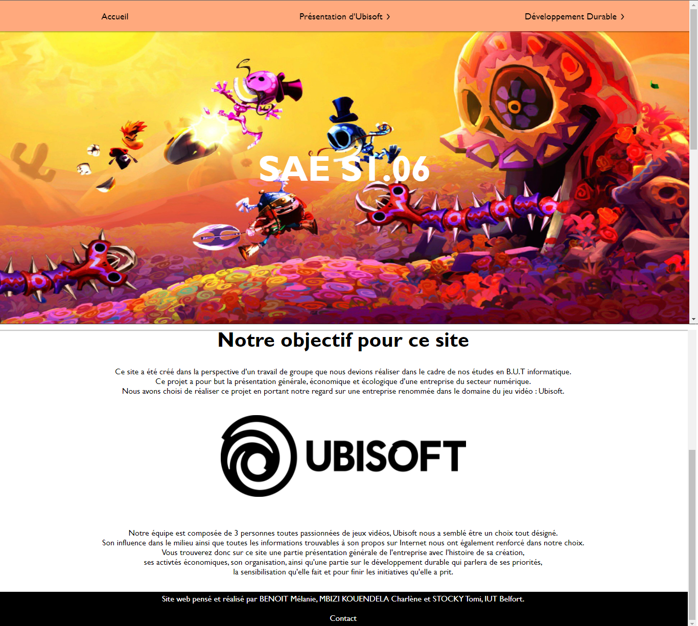

# Ubisoft-SAE_D

Groupe D1
BENOIT Mélanie
STOCKY Tomi
MBIZI KOUDENLA Charlène

[Mail Mélanie BENOIT](mailto:mbenoit@edu.univ-fcomte.fr?subject=[SAE 1.06]) 

# Livrable parties Économie et Documents numérique
[Rapport economique](doc/BENOIT_S1D1_RapportUBISOFT.pdf)
En terme de couleurs pour le site, nous avons décidé d'opter pour une couleur principale  orange clair car la couleur orange symbolise généralement  le dynamisme et la créativité. Sachant que l'une des activités principales d'Ubisoft est de développer des jeux-vidéo, cette couleur est légitime. 
Le reste des pages sera en blanc pour éviter une surcharge de couleurs  et que ce soit agréable à l'oeil. Le contenu texte sera en noir et nous avons opté pour une police  Gill Sans pour un aspect moderne.

